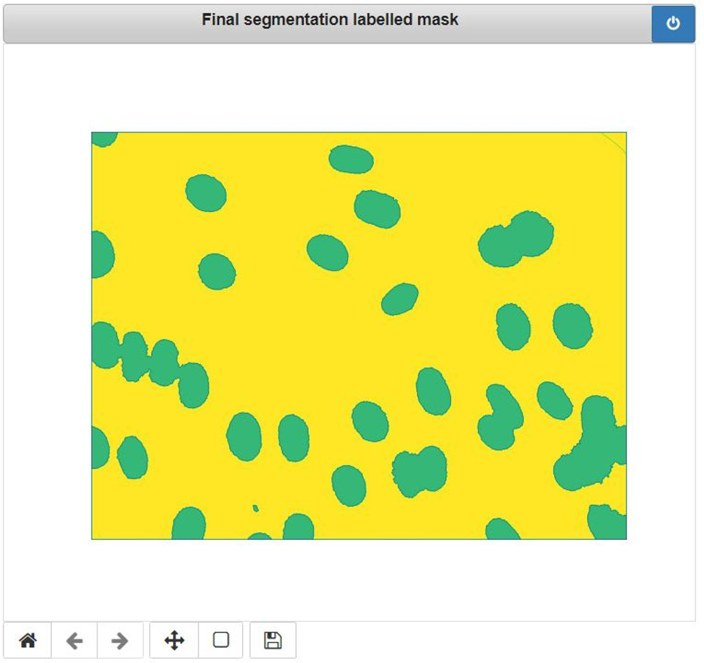

# Watershed Image Segmentation in Python

## 1. Objective

The objective of this project is to demonstrate the development of the Watershed image segmentation algorithm using OpenCV Python.

## 2. Watershed Algorithm

One of the most popular methods for image segmentation is called the Watershed algorithm. It is often used when we are dealing with one of the most difficult operations in image processing – separating similar objects in the image that are touching each other:

  * To understand the motivation behind the watershed algorithm we need to think of a grayscale image as a topographic surface. In such an image high-intensity pixel values represent peaks (white areas), whereas low-intensity values represent valleys – local minima (black areas). 
  * Now, imagine that we start filling every isolated valley with water. What will happen? Well, the rising water from different valleys will start to merge. 
To avoid that, we need to build barriers in the locations where the water would merge. These barriers we call watershed lines and they are used to determine segment boundaries. 
  * Then, we continue filling water and building watershed until the water level reaches the height of the highest peak. At the end of the process, only watershed lines will be visible and that will be the final segmentation result. 
  * So, we can conclude that the goal of this algorithm is to identify watershed lines.
  * In essence, we partition the image into two different sets: the dark areas are called catchment basins – the group of connected pixels with the same local minimum. 
  * Lines that divide one catchment area from another are called watershed lines. 
  * The watershed segmentation in 2D is represented in the following image. 
    * As you can see when we raise the yellow threshold eventually segment 1 and segment 2 will be merged, 
    * Therefore, we need to put the first watershed line. 
    * Afterward, segment 2 and segment 3 will be merged so we need to add another watershed line.

## 3. Data

We shall test the developed watershed segmentation using the following 5 test images.

## 4. Development

In this section, we shall walkthrough the development and illustration of the watershed segmentation algorithm using OpenCV built-in functionalities. 

<pre style="color:#000000;background:#e6ffff;font-size:10px;line-height:1.5;">#--------------------------------------------------------------
# File: image-segmentation-watershed.ipynb
#--------------------------------------------------------------
# Objective: Implementation of image segmentation watershed 
#            segmentation algorithm using OpenCV-Python 
#            built-in functionalities.
#--------------------------------------------------------------
# Author: mghazel
# date: March 26, 2021
#--------------------------------------------------------------
</pre>

### 4.1. Step 1: Python imports and global variables:

#### 4.1.1. Python Imports

<pre style="color:#000000;background:#e6ffff;font-size:10px;line-height:1.5;"># system environment
import sys
# I/O
import os
# OpenCV
import cv2
# Numpy
import numpy as np
# matplotlib
import matplotlib.pyplot as plt
import matplotlib.image as mpimg

import argparse
import random as rng
rng.seed(12345)

# Make figures visible
%matplotlib notebook

# display used packages versions
print("Python version : {0} ".format(sys.version))
print("OpenCV version : {0} ".format(cv2.__version__))
print("Numpy version  : {0}".format(np.__version__))

Python version : 3.8.5 (default, Sep  3 2020, 21:29:08) [MSC v.1916 64 bit (AMD64)] 
OpenCV version : 3.4.8 
Numpy version  : 1.19.2
</pre>

#### 4.1.2. Global Variables

<pre style="color:#000000;background:#e6ffff;font-size:10px;line-height:1.5;">#--------------------------------------------------------------
# A flag to indicate whether to apply and use thresholding on 
# the distance transform to get the sure-foreground region 
#--------------------------------------------------------------
# set flag to 1 to use the thresholded distance-transform
use_thresholed_distance_transform_flag = 0
</pre>

### 4.2. Step 2: Read, resize and visualize the input image:

* We shall use the "Medical cells # 1" image for code development and illustration
* We shall only show the final segmentation results for the other four test images. 

<pre style="color:#000000;background:#e6ffff;font-size:10px;line-height:1.5;">#--------------------------------------------------------------
# Step 1: Read the input image 
#--------------------------------------------------------------
# the image file name
#--------------------------------------------------------------
# Test-image-01: medical blood cells test image # 1
#--------------------------------------------------------------
fname = os.path.join("resources","images","blood-cells-01.png")
#--------------------------------------------------------------
# Test-image-02: medical blood cells test image # 2
#--------------------------------------------------------------
# fname = os.path.join("resources","images","blood-cells-02.jpg")
#--------------------------------------------------------------
# Test-image-03: coins test image
#--------------------------------------------------------------
# fname = os.path.join("resources","images","coins.jpg")
#--------------------------------------------------------------
# Test-image-04: oranges test image
#--------------------------------------------------------------
# fname = os.path.join("resources","images","oranges.png")
#--------------------------------------------------------------
# Test-image-05: outdoor-scene test image
#--------------------------------------------------------------
# fname = os.path.join("resources","images","outdoors-scene.jpeg")
#--------------------------------------------------------------
# read the input image
# img = mpimg.imread(fname)
img = cv2.imread(fname)
#--------------------------------------------------------------
# visualize the input image
#--------------------------------------------------------------
# create the figure and set its size and title
#--------------------------------------------------------------
plt.figure("Input image", figsize=(6,5))
# Show the image
plt.imshow(cv2.cvtColor(img, cv2.COLOR_BGR2RGB))
plt.axis('off')
plt.show()
</pre>

### 4.3. Step 3: Apply adaptive thresholding to binarize the image:

* Convert the input image to grayscale if it is RGB
* Apply Otsu's binarization to suppress the background
* This allows us detect the image foreground, contains the objects of interest (the cells)

<pre style="color:#000000;background:#e6ffff;font-size:10px;line-height:1.5;">#--------------------------------------------------------------
# Step 2: Perform initial segmentation via Otsu Binarization
#--------------------------------------------------------------
# if the image is RGB then convert to grayscale
if ( len(img.shape) &gt; 1 ):
    gray = cv2.cvtColor(img,cv2.COLOR_BGR2GRAY)
else: # make a copy of the image
    gray = img.copy()

# Apply image thresholding via Otsu’s binarization.
ret, thresh = cv2.threshold(gray,0,255,cv2.THRESH_BINARY_INV+cv2.THRESH_OTSU)
#--------------------------------------------------------------
# visualize the results
#--------------------------------------------------------------
# create the figure and set its size and title
#--------------------------------------------------------------
plt.figure("Binary image", figsize=(6,5))
# display the binary image
plt.imshow(thresh, cmap='gray', vmin=0, vmax=255)
# remove the axes
plt.axis('off')
# show the figure
plt.show()
</pre>

### 4.4. Step 4:  Perform coarse segmentation of the binarized image:

* Foreground region:
  * Contains the objects of interest
* Background area:
  * Needs to be filtered out as we are not interested in this part
* The remaining unknown region:
  * We are not confident if this part belongs to the foreground or background?

 
<pre style="color:#000000;background:#e6ffff;font-size:10px;line-height:1.5;">#--------------------------------------------------------------
# Step 3: Segment the image into 3 parts:
#         3.1) sure foreground area
#         3.2) sure background area
#         3.3) the rest of the image (unknown region)
#--------------------------------------------------------------
# first, apply noise removal via morphological opetations
# create the filter kernel
kernel = np.ones((3,3),np.uint8)
# apply the morphological operation
opening = cv2.morphologyEx(thresh,cv2.MORPH_OPEN,kernel, iterations = 2)
#--------------------------------------------------------------
# 3.1) Segment the sure-background region
#--------------------------------------------------------------
# get the sure background region
sure_bg = cv2.dilate(opening,kernel,iterations=3)
#--------------------------------------------------------------
# 3.2) Segment the sure-foreground region
#--------------------------------------------------------------
# first apply the distance transform
dist_transform = cv2.distanceTransform(opening,cv2.DIST_L2,5)
# threshold the distance transform to get the sure-foreground region 
ret, sure_fg = cv2.threshold(dist_transform, 0.250*dist_transform.max(),255,0)

#--------------------------------------------------------------
# 3.2) Segment the remaining unknown region
#--------------------------------------------------------------
# convert to unit8 image
sure_fg = np.uint8(sure_fg)
# subtract the foreground from the background to get the unknown region
unknown_rg = cv2.subtract(sure_bg, sure_fg)

#--------------------------------------------------------------
# visualize the results
#--------------------------------------------------------------
# create the figure and set its size and title
#--------------------------------------------------------------
plt.figure("Background vs. Foreground segmentation", figsize=(10,3))

#--------------------------------------------------------------
# display the distance-transform image
#--------------------------------------------------------------
# create a subplot
plt.subplot(131)
# display the image
plt.imshow(dist_transform, cmap='gray')
# add the title
plt.title("Distance-Transform", fontsize=8)
# remove the axes
plt.axis('off')
# show the figure
plt.show()

#--------------------------------------------------------------
# display the background image
#--------------------------------------------------------------
# create a subplot
plt.subplot(132)
# display the image
plt.imshow(sure_bg, cmap='gray')
# add the title
plt.title("Background", fontsize=8)
# remove the axes
plt.axis('off')
# show the figure
plt.show()

#--------------------------------------------------------------
# display the foreground image
#--------------------------------------------------------------
# create a subplot
plt.subplot(133)
# display the image
plt.imshow(sure_fg, cmap='gray')
# add the title
plt.title("Foreground", fontsize=8)
# remove the axes
plt.axis('off')
# show the figure
plt.show()
</pre>

### 4.5. Step 5: Label the three sub-regions segmented in the previous step:

* Foreground region:  the objects of interest (label  1)
* Background area (label: -1)
* The remaining unknown region (label = 0)

<pre style="color:#000000;background:#e6ffff;font-size:10px;line-height:1.5;">#--------------------------------------------------------------
# Step 4: Label the different regions segmented above:
#         3.1) sure foreground area (label = 1)
#         3.2) sure background area
#         3.3) the rest of the image, unknown region (label = 0)
#--------------------------------------------------------------
# It was observed that we achieve better segmentation results
# if the distance transform results are not segmented:
#--------------------------------------------------------------
if ( use_thresholed_distance_transform_flag == 0 ):
    sure_fg = dist_transform
    # convert to unit8 image
    sure_fg = np.uint8(sure_fg)
#--------------------------------------------------------------   
# Marker labelling of the foreground-region
ret, markers = cv2.connectedComponents(sure_fg)
# Add one to all labels so that sure foregrouund is not 0, but 1
markers = markers+1
# Now, mark the unknown-region with zero
markers[unknown_rg==255] = 0
#--------------------------------------------------------------
# create the figure and set its size and title
#--------------------------------------------------------------
plt.figure("Markers image after labelling", figsize=(6,5))
# Show the image
plt.imshow(markers)
plt.axis('off')
plt.show()
</pre>

#### Observations: 

* In view of the three labeled regions illustrated in the figure above, we make the following observations:

  * We now know for sure the foreground regions, color-coded in light-blue, corresponding to the objects of interest (coins). 
  * We also know for sure the background regions, color-coded in purple.
  * The remaining regions are those which we still are not sure whether they belong to the foreground (coins) or background. 
  * These areas are normally around the boundaries of coins where foreground and background meet (Or even two different coins meet). We call it border.
  * Next, we apply the Watershed algorithm to segment these unknown regions and assign them to the background or foreground sub-regions.

### 4.6. Step 6:  Apply the Watershed Algorithm:

* Apply the Watershed algorithm to:
  * Segment these unknown regions
  * Assign them to the background or foreground sub-regions
  * Generate the final image segmentation results.

<pre style="color:#000000;background:#e6ffff;font-size:10px;line-height:1.5;">#--------------------------------------------------------------
# Step 5: Apply Watershed segmentation:
#--------------------------------------------------------------
# Now our marker is ready. It is time for final step, apply watershed. 
markers = cv2.watershed(img,markers)
#--------------------------------------------------------------
# The boundary region of the segmented markers will be marked 
# with -1.
#--------------------------------------------------------------
# get the image flag
# img.flags
# ensure that we can modify the image
img.setflags(write=1)
# modilfy the image color along the markers
# - set color to: YELLOW
img[markers == -1] = [0,0,255]

#--------------------------------------------------------------
# create the figure and set its size and title
#--------------------------------------------------------------
plt.figure("Final segmentation labelled mask", figsize=(6,5))
#--------------------------------------------------------------
# display the segmented markers image
#--------------------------------------------------------------
# display the image
plt.imshow(markers)
# remove the axes
plt.axis('off')
# show the figure
plt.show()
</pre>

We observe that the foreground (coins) and the background are now clearly segmented without any ambiguities, thanks to the Watershed algorithm.

### 4.7. Step 7: Display the final segmentation results:

* We generated boundary contours of the segmented cells.

### 4.8. Step 8: Display the end of successful execution message:

* Display a successful end of execution message

<pre style="color:#000000;background:#e6ffff;font-size:10px;line-height:1.5;"># display a final message
# current time
now = datetime.datetime.now()
# display a message
print('Program executed successfully on: '+ str(now.strftime("%Y-%m-%d %H:%M:%S") + "...Goodbye!\n"))
</pre>
<pre style="color:#000000;background:#ffffff;">Program executed successfully on: 2021-04-03 22:03:44...Goodbye!
</pre>

* In view of the final image segmentation results, we make the following observations:

  * All isolated cells are perfectly segmented
  * Adjacent cells, with overlapping edges, are still correctly detected but they are merged together.
  * The algorithm yields perfect semantic segmentation and reasonably good instance segmentation result
  * We shall explore improving the instance segmentation results for overlapping or touching cells, by adjusting some of the algorithm configuration parameters.

### 4.9. Additional Segmentation Results

* In this section, we shall illustrate the final segmentation results (labelled map and contours) for the remaining four test images.

## 6. Analysis

* In view of the final image segmentation results, we make the following observations:

  * All isolated cells are perfectly segmented
  * Adjacent cells, with overlapping edges, are still correctly detected but they are merged together
  * The algorithm yields perfect semantic segmentation and reasonably good instance segmentation results
  * We shall explore improving the instance segmentation results for overlapping or touching cells, by adjusting some of the algorithm configuration parameters.

## 7. Future Work

* We propose to explore the following related issues:

  * We shall explore improving the instance segmentation results for overlapping or touching cells, by adjusting some of the algorithm configuration parameters.

## 8. References

1. OpenCV. Image Segmentation with Watershed Algorithm. https://opencv-python-tutroals.readthedocs.io/en/latest/py_tutorials/py_imgproc/py_watershed/py_watershed.html
2. OpenCV. Image Segmentation with Watershed Algorithm. https://docs.opencv.org/master/d3/db4/tutorial_py_watershed.html
3. OpenCV. Image Segmentation with Distance Transform and Watershed Algorithm. https://www.ccoderun.ca/programming/doxygen/opencv/tutorial_distance_transform.html
4. Zivkovic, S. OpenCV projects – Image segmentation with Watershed algorithm http://datahacker.rs/007-opencv-projects-image-segmentation-with-watershed-algorithm/
5. OpenCV. Image Thresholding.  https://opencv-python-tutroals.readthedocs.io/en/latest/py_tutorials/py_imgproc/py_thresholding/py_thresholding.html.
